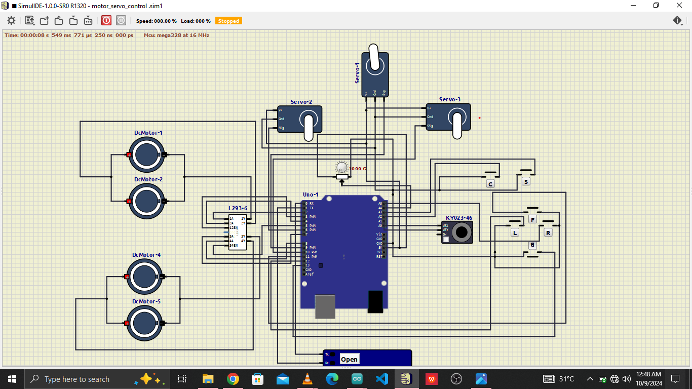

# motor_servo_control_system

This is a simulation of a robot control system I made  about a year ago using the simulIDE circuit simulator for my on-going robot dog. The simulation features the all components of the circuitry and the code for the microcontroller.

## The Circuit.
- The circuit in the simulation includes  2 pair of DC motors, 3 servo motors, a L293d motor driver, a KY023 Joystick motor, 6 tact switches, a potentiometer and an Arduino uno as the microcontroller.
The circuit is designed to process to the states of the switches, joystick and the simulated ultrasonic sensor(done in the code) and react by controlling the system to react accordingly. 

## The Code.
The code for the microcontroller used in the simulation (Arduino uno) was written using the Arduino C/C++ framework. The code features several functions to carry out specific tasks which includes, 
- Reading and processing inputs from the joystick and switches
- Controlling the speed, direction and motion duration of the motors.
- Controlling the angle of the robot on the x-y plane.
- Tracking the motion of the robot on the x-y plane.
- Monitoring the battery level and adjusting the system accordingly (the battery voltage is simulated by the potentiometer in the circuit).
- Reading and processing distance sensor data.
- Controlling the servos.

The code and circuit gives the robot the following functionalities:
- The system can carry out variety of motion in the x-y plane by controlling the motors based on the input.
- The system is awareness of motion, distance travelled and speed in the x-y axis.
- The system can spot if there's an obstacle along it's path while in motion and scan through the obstacle using the simulated ultrasonic sensor attached to one of its servo to get distance details about the obstacle in relation to the position of the bot at the time to determine, the position and dimension of the obstacle and there's space around to navigate around.
PS: The distance gotten from the ultrasonic sensor where hard coded into to the code and can be adjusted to get the system to react.

This simulation project gave me a good blueprint  of how to go about building the actual project which is quite different from the simulation but still retains the same concepts just a little bit better and more complex.

